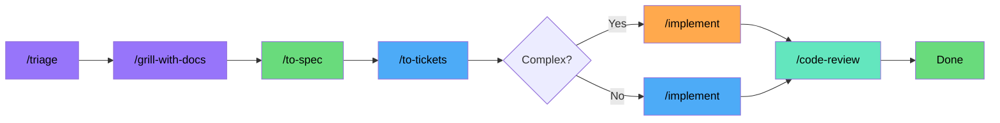
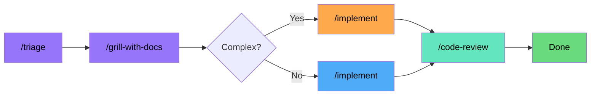
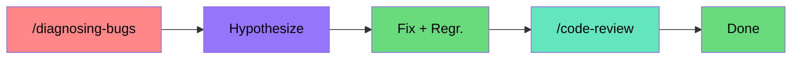
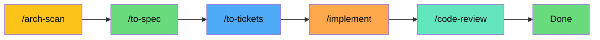
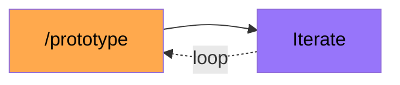
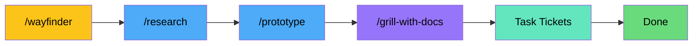

# AI Coding Workflow

Inspired by **Matt Pocock's** skills -- real engineering, not vibe coding.

Uses **OpenCode Go**.
All skills from [`mattpocock/skills`](https://github.com/mattpocock/skills).

---

## Routing Philosophy

**V4 Flash is the default for everything.** It scores 79% SWE-bench Verified, has 1M context, costs $0.14/$0.28 per million tokens, and has 31,650 req/5h — effectively unlimited. Start here for every stage of every pipeline.

**Escalate only when Flash proves insufficient.** Don't pre-assign expensive models to stages based on what the stage *could* need. Wait for a concrete failure, then retry with a stronger model.

| Escalation path | When | Escalate to |
|----------------|------|-------------|
| /triage gives wrong category | Rare — Flash handles this fine | K2.7 Code |
| /grill produces shallow CONTEXT.md | Feature-add to a complex codebase | K2.7 Code |
| /to-spec misses architectural nuance | Complex greenfield with tricky domain | V4 Pro |
| /implement produces wrong architecture | Multi-file, cross-cutting change | V4 Pro |
| /implement keeps breaking constraints | Large-scale redesign | V4 Pro |
| Bug hypotheses keep being wrong | 3+ false hypotheses in a row | K2.7 Code |
| Bug fix keeps failing tests | Correctness-critical fix | V4 Pro |
| Architecture scan or wayfinding | Always needs deep reasoning | Qwen3.7 Max |

The savings are dramatic: ~$0.04 for a simple feature vs ~$0.42 with the old model-per-stage routing. You stay safely within the $60/month budget even on heavy months.

---

## Pipeline Diagrams

### 1. NEW PROJECT (from scratch)



Start with `/triage` to categorize the ask. `/grill-with-docs` interviews you about the domain, builds CONTEXT.md. `/to-spec` formalizes what was discussed. `/to-tickets` breaks it into vertical-slice tickets with blocking edges. `/implement` writes the code — V4 Flash by default, V4 Pro if the implementation fails quality gates. `/code-review` checks standards and spec compliance.

### 2. ADDING A FEATURE



A lighter pipeline. `/triage` and `/grill-with-docs` research the existing codebase to understand context. Skip spec and tickets — you're extending what's there, not starting fresh. `/implement` writes the feature on V4 Flash, then `/code-review` checks it. For cross-cutting changes touching 3+ modules, rerun `/implement` on V4 Pro.

### 3. BUG FIX



`/diagnosing-bugs` runs the 6-phase loop. Phase 1 builds a tight repro (V4 Flash, iterate cheap). Phase 2 minimizes it. Phase 3 generates ranked hypotheses — escalate to K2.7 Code if Flash generates 3+ false hypotheses. Phase 4 instruments. Phase 5 writes the fix and regression test — escalate to V4 Pro if the fix keeps failing tests. Phase 6 cleans up debug tags and commits. Review with `/code-review`.

### 4. ARCHITECTURE REDESIGN



`/improve-codebase-architecture` scans the codebase for deepening opportunities and generates an HTML report — Qwen3.7 Max is always used here because deep reasoning is non-negotiable. `/to-spec` formalizes the plan (V4 Pro — synthesizes scan output, no deep reasoning needed). `/to-tickets` slices into work items. `/implement` with V4 Pro handles large-scale changes (needs 1M context). `/code-review` to confirm.

### 5. PROTOTYPE / SPIKE



`/prototype` generates throwaway code to answer a design question. V4 Flash or MiMo V2.5 only — speed over quality. Iterate with the same cheap model until you have your answer. No spec, no review — this is learning, not shipping.

### 6. WAYFINDER (complex project, multiple sessions)



For projects too big for one agent session. Creates a **map** of decision tickets on the issue tracker. `/wayfinder` charts the initial map with Qwen3.7 Max — charting unknown territory needs max reasoning. Everything after is V4 Flash sub-agents: research tickets, prototype tickets, grilling tickets, task tickets.

---

## Model Reference

Pricing via OpenCode Go. "Req/5h" = estimated requests per 5-hour rolling window.

| Model | Input $/1M | Output $/1M | Req/5h | Req/mo | Context | Key Strength |
|---|---|---|---|---|---|---|
| **Qwen3.7 Max** | $2.50 | $7.50 | 950 | 4,770 | 1M | Highest SWE-bench Pro on Go (60.6%). Best for hard planning. |
| **DeepSeek V4 Pro** | $0.435 | $0.87 | 3,450 | 17,150 | 1M | LiveCodeBench 93.5%, Codeforces 3206. Strongest for implementation. |
| **Kimi K2.6** | $0.95 | $4.00 | 1,150 | 5,750 | 262K | Agent Swarm (300 sub-agents). Best for agentic multi-file changes. |
| **Kimi K2.7 Code** | $0.95 | $4.00 | 1,350 | 6,750 | 256K | Coding-focused model. More requests than K2.6. Solid mid-tier planner. |
| **DeepSeek V4 Flash** | $0.14 | $0.28 | **31,650** | 158,150 | 1M | **Default workhorse.** 79% SWE-bench Verified. Cheap. Fast. |
| **MiMo V2.5** | $0.14 | $0.28 | 30,100 | 150,400 | 1M | Budget workhorse. Same price as Flash, 1M context. |
| **MiniMax M2.7** | $0.30 | $1.20 | 3,400 | 17,000 | 205K | Strong cost-per-benchmark-point (78% SWE-bench Verified at $0.30). |

---

## Pipeline: Use Case & Routing

### 1. NEW PROJECT (from scratch)


| Stage | Default | Escalation | Why |
|-------|---------|------------|-----|
| **Triage** | V4 Flash | — | Greenfield has no codebase to read. Simple categorization. |
| **Interview** | V4 Flash | — | Domain conversation, no codebase research. Flash handles this fine. |
| **Spec** | V4 Flash | V4 Pro if spec misses architectural nuance | Synthesis of existing conversation. Pure formatting. |
| **Tickets** | V4 Flash | — | Mechanical breakdown. |
| **Implement (simple)** | V4 Flash | — | Single file, straightforward logic. |
| **Implement (complex)** | V4 Flash first | V4 Pro if implementation fails quality gates | Try cheap first. Escalate only when Flash proves insufficient. |
| **Code Review** | V4 Flash | — | Read diffs, check standards. Flash handles this fine. |

**Est. cost:** simple ~**$0.04** | complex ~**$0.13**

---

### 2. ADDING A FEATURE


| Stage | Default | Escalation | Why |
|-------|---------|------------|-----|
| **Triage** | V4 Flash | K2.7 Code if triage consistently misclassifies | Codebase reading — Flash can do it, but K2.7's coding focus may help for tricky domains. |
| **Interview** | V4 Flash | K2.7 Code if grill produces shallow CONTEXT.md | Codebase exploration. Start Flash, escalate if shallow. |
| **Implement (simple)** | V4 Flash | — | Small change in existing patterns. |
| **Implement (cross-cutting)** | V4 Flash first | V4 Pro if touches 3+ modules | Complex needs the 1M context and deeper reasoning. |
| **Code Review** | V4 Flash | — | Review pass. Flash handles this fine. |

**Est. cost:** simple ~**$0.03** | cross-cutting ~**$0.08**

---

### 3. BUG FIX (6-phase diagnosis)


Matt Pocock's `/diagnosing-bugs` is a 6-phase discipline. **Phase 1 is where the real work happens** — build a tight red/green feedback loop before you do anything else.

| Phase | Steps | Default | Escalation | Why |
|-------|-------|---------|------------|-----|
| **Ph 1: Feedback loop** | Build harness, test, curl, script, etc. | **V4 Flash** | — | Mechanical work — write code to catch the bug. You'll iterate a lot, so keep it cheap. |
| **Ph 2: Reproduce+minimise** | Run the loop, shrink to minimal repro. | **V4 Flash** | — | Lots of iterations. Flash is fast and cheap. |
| **Ph 3: Hypothesise** | Generate 3-5 ranked falsifiable hypotheses. | **V4 Flash** | **K2.7 Code** if 3+ false hypotheses in a row | Needs reasoning about causality. Start Flash, escalate if stuck. |
| **Ph 4: Instrument** | Change one variable at a time. Tag every debug log. | **V4 Flash** | — | High volume of small probes. |
| **Ph 5: Fix + regr. test** | Write regression test before fix. Watch fail→fix→pass. | **V4 Flash** | **V4 Pro** if fix keeps failing tests | Correctness-critical. V4 Pro for when Flash can't solve it. |
| **Ph 6: Cleanup** | Remove debug tags, commit, post-mortem. | **V4 Flash** | — | Mechanical cleanup. |

**Est. cost:** easy ~**$0.05** | hard ~**$0.18**

---

### 4. ARCHITECTURE REDESIGN


| Stage | Model | Why |
|-------|-------|-----|
| **Architecture scan** | **Qwen3.7 Max** (always) | Produces an HTML report of deepening opportunities. Needs the best reasoning (60.6% SWE-bench Pro, 69.7% Terminal-Bench). Non-negotiable. |
| **Spec** | **V4 Pro** | Synthesis of scan output, not new reasoning. Qwen is overkill here. |
| **Tickets** | **V4 Flash** | Breaking into tickets is mechanical. |
| **Implement** | **V4 Pro** | Large-scale changes need 1M context. |
| **Code Review** | **V4 Flash** | Review pass. |

**Est. cost:** ~**$0.25**

---

### 5. PROTOTYPE / SPIKE


Throwaway code that answers a question. Speed over quality. Don't burn expensive models here.

| Stage | Model | Why |
|-------|-------|-----|
| **Prototype** | **V4 Flash** or **MiMo V2.5** | ~30,000 req/5h = unlimited. MiMo gives 1M context at same price. |
| **Iterate** | Same | |

**Est. cost:** ~**$0.01**

---

### 6. WAYFINDER (complex project, multiple sessions)


For projects too big for one agent session. Creates a **map** of decision tickets on the issue tracker.

| Stage | Model | Why |
|-------|-------|-----|
| **Chart the map** | **Qwen3.7 Max** (always) | Name the destination, surface fog, create the initial tickets. Needs max reasoning. Non-negotiable. |
| **Research tickets** | **V4 Flash** | Read docs, investigate APIs. High volume, cheap. |
| **Prototype tickets** | **V4 Flash** | Throwaway code to answer design questions. |
| **Grilling tickets** | **V4 Flash** | Conversation to sharpen decisions one at a time. |
| **Task tickets** | **V4 Flash** | Mechanical setup work. |

**Est. cost:** ~**$0.15-0.30**

---

## Prompt Guidance Per Stage

### `/grill-with-docs` — The Interview

```
/grill-with-docs interview me about [FEATURE].
I want to understand the domain, the problem, and what a good solution looks like.
```

Matt's skill:
1. Explores codebase first (understand current state)
2. Uses `/domain-modeling` to challenge fuzzy terms — when you say "user", do you mean Customer or Account Holder?
3. Writes terms to `CONTEXT.md` as they crystallize (not batched)
4. Offers ADRs sparingly — only when **hard to reverse + surprising + real trade-off**

### `/to-spec` — From Conversation to Spec

Synthesizes what you already discussed -- don't re-interview. Produces 6 sections:

1. **Problem Statement** — user's perspective
2. **Solution** — user's perspective
3. **User Stories** — extensive numbered list (As a <actor>, I want <feature>, so that <benefit>)
4. **Implementation Decisions** — modules, interfaces, schemas, API contracts (no file paths/code snippets)
5. **Testing Decisions** — seams, what makes a good test
6. **Out of Scope** — explicitly what's NOT being built

### `/to-tickets` — Breaking into Tickets

Each ticket is a **tracer bullet** — vertical slice through every layer:
- Schema → API → Logic → Tests → UI
- Each slice demoable on its own
- Sized for one fresh context window
- Blocking edges declared

### `/implement` — Writing Code

- Runs tests via `/tdd` at pre-agreed seams
- Typechecking as you go
- Single test files as you go
- Full test suite at the end
- Auto-runs `/code-review` when done
- Commits to current branch

### `/code-review` -- Two-Axis Review

```
/code-review review since main
```

Runs **two parallel sub-agents**:
- **Standards** -- does the code follow documented standards and avoid Fowler code smells?
- **Spec** -- does the code match what the issue asked for?

They report independently. A change can pass one axis and fail the other.

### `/diagnosing-bugs` -- 6 Phases

| If someone says "it doesn't work" | Don't jump to hypothesizing |
|----------------------------------|------------------------------|

Phase 1 is the critical step: build a tight red/green signal before anything else. A 2-second deterministic loop changes everything. A 30-second flaky loop is barely useful.

### Diagram Generation (Documentation Pipeline)

When documenting a feature or spec, add Mermaid diagrams alongside the text. The README in this repo shows the format: ` ```mermaid ` blocks with `graph LR` or `graph TD`, color-coded nodes, and branching decisions.

**Where diagrams add value:**
- Pipeline flows (which stage, which model, when to branch) -- as shown above
- Architecture: module relationships, data flow, component hierarchy
- State machines in specs / ADRs -- `/domain-modeling` produces CONTEXT.md, diagrams make it visual

**Model for diagram generation:** V4 Flash. It's cheap and Mermaid syntax is simple. Don't waste a reasoning model on layout.

---

## Model Route Quick Reference

| Task Type | Default | Escalation | Est. req |
|-----------|---------|------------|----------|
| Triage | V4 Flash | K2.7 Code | 1-2 |
| Codebase research / grill | V4 Flash | K2.7 Code if shallow | 3-8 |
| Planning / spec (new project) | V4 Flash | V4 Pro | 1-3 |
| Tickets | V4 Flash | — | 3-5 |
| Implementation (simple) | V4 Flash | — | 3-8 |
| Implementation (complex) | V4 Flash first | V4 Pro if fails quality gates | 5-15 |
| Debugging (loop) | V4 Flash | — | 10-50 |
| Debugging (hypothesis) | V4 Flash | K2.7 Code if stuck | 3-5 |
| Debugging (fix) | V4 Flash | V4 Pro if fix fails tests | 2-5 |
| Architecture scan | Qwen3.7 Max | — | 1-3 |
| Prototype | V4 Flash / MiMo | — | 5-20 |
| Code review | V4 Flash | — | 2-4 |
| Wayfinder (map) | Qwen3.7 Max | — | 1-3 |

---

## Budget Tracking

$60/month. A typical feature cycle costs ~**$0.04-0.25** with the default-first routing.
That's **240-1,500 features per month** if you route correctly.

| Routing strategy | Features/month (max) |
|---|---|
| **Flash-first (this guide)** | **~240-1,500** |
| Flash for everything | ~200+ |
| Balanced (per-stage model pinning) | ~60-120 |
| Qwen3.7 Max for everything | ~5-10 (don't) |

The buffer is now large enough ($40-50/month) that even heavy months with multiple architecture scans, wayfinders, and bug fixes won't break the budget.

---

## Learning & Iteration

This workflow will change. New models arrive on Go, skills evolve, and you'll find what works for you. Keep updating this doc and track the changes in git — the history of what changed and why matters more than the current state.
