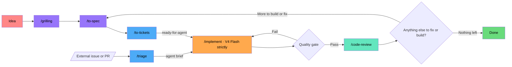

# AI Coding Workflow

Inspired by **Matt Pocock's** skills -- AI Engineering/ Coding??? lol. Runs on **OpenCode Go** with [`mattpocock/skills`](https://github.com/mattpocock/skills).

---

## The main pipeline

```
idea → grilling → to-spec → to-tickets → implement → code-review
```



A fuzzy idea walks in, gets grilled into shape, specced, sliced into tickets (agent-ready the moment they're published), built, and reviewed before it ships. Work that arrives from outside — bug reports, feature requests, unannounced PRs — enters through the triage lane below: verified, briefed, then dropped into the same implement queue.

## Triage — the inbound lane

<details>
<summary>triage:</summary>

Only for issues and PRs that arrived from outside — bug reports, feature requests, unannounced PRs. Not for my own tickets: to-tickets publishes those already ready-for-agent, so triaging them is wasted work. Upstream's flat rule: "/triage is only for issues you didn't create". I'll rarely open this — correct, it's the front door for the day a repo takes outside work. The agent never reaches for it on its own; I type `/triage` + what I want ("show me what needs attention", "look at #42").
- Recommends a category (`bug` / `enhancement`) + state, then waits — applies nothing until I say so
- Verifies before briefing: reproduces the bug or checks out the PR + runs its tests → confirmed (with code path) / failed / not enough detail (the strongest needs-info signal)
- Redundancy check by domain concept + `.out-of-scope/` prior-rejection check, then grills with `/domain-modeling` if it needs shaping
- `ready-for-agent` = post an agent brief — the contract (AGENT-BRIEF.md): types/signatures/behavioural contracts, no file paths or line numbers, complete acceptance criteria, explicit out-of-scope. The original report is just context
- `.out-of-scope/` = one file per rejected concept, matched by concept not keyword; already-implemented never goes there (the comment just points at it)
- `needs-info` = "what we've established so far" + "what we still need (@reporter)"; resuming reads prior notes and never re-asks
- "move #42 to ready-for-agent" = quick override, skips grilling
- On a PR the states read against the diff: ready-for-agent = next step on the code, ready-for-human = ready to merge. Discovery surfaces external PRs only (flag default off in `docs/agents/issue-tracker.md`)
- Create the 7 labels once per tracker — setup writes the mapping, not the labels (#616)
- Every tracker comment prefixed `> *This was generated by AI during triage.*`
- Working if: exactly one category + one state, recommends and waits, verifies before briefing

</details>

Default: V4 Flash<br>
Escalation: max effort if it keeps misclassifying (rare — inbound lane only)

## Agents

I use the **`build`** agent for everything (`opencode run --agent build`). `plan` is too restricted: it can't write CONTEXT.md/ADRs/tickets or spawn `general` subagents. Not worth the mental overhead of deciding per stage.

---

## Stages

<details>
<summary>grilling:</summary>

An interview in rounds over a **design tree** (every decision branches into the decisions hanging off it).
- Each round asks the whole **frontier** (the decisions whose prerequisites are already settled), numbered, with a recommended answer for each
- **Facts are my job, not yours** — I dispatch sub-agents to look things up instead of making you research
- Done when the frontier is empty: every branch visited, nothing silently assumed
- `grill-me` = alias for the same session · `grill-with-docs` = grilling + `/domain-modeling` (writes ADRs + the CONTEXT.md glossary as decisions land)

</details>

Default: V4 Flash<br>
Escalation: GLM 5.2 / Luna if the grill comes back shallow

<details>
<summary>to-spec:</summary>

Do NOT re-interview. It just writes.
1. Sketches the test seams first and checks them with you (existing seams preferred, highest possible, ideally one)
2. Writes: Problem → Solution → User Stories → Implementation Decisions → Testing Decisions → Out of Scope
3. Publishes per tracker (`.scratch/<slug>/spec.md` or a real issue) and applies `ready-for-agent`

</details>

Default: V4 Flash<br>
Escalation: GLM 5.2 (max effort) if it misses nuance

<details>
<summary>to-tickets:</summary>

Tracer-bullet tickets: narrow vertical slices through every layer (schema → API → logic → tests → UI), each demoable on its own and sized for one fresh context window. Every ticket declares its blocking edges.
- Quizzes you on granularity before publishing (too coarse? too fine? merge? split?)
- Publishes `.scratch/<slug>/issues/<NN>-<slug>.md` (01+, blockers first, `Status: ready-for-agent`) or native blocking links on a real tracker
- Wide refactors are the exception → **expand–contract**, not slices

</details>

Default: V4 Flash<br>
Escalation: none

<details>
<summary>implement:</summary>

`/tdd` at pre-agreed seams → typecheck regularly → full suite → `/code-review` → commit.
- Code review is built in — it runs at the end of implement, no extra step to remember
- After it commits, I ask if there's anything else to fix or build. If yes, we loop the whole pipeline (to-spec → to-tickets → implement → review) and do it again
- Start implement in a **fresh session** — to-spec and to-tickets already wrote the spec + tickets into `.scratch/`, so the new session picks them up from disk with clean context

</details>

Default: V4 Flash<br>
Escalation: max effort only — no model switch

<details>
<summary>code-review:</summary>

Reviews `fixed-point...HEAD` (your commit/branch/tag, three-dot so it compares against the merge-base) on two parallel axes:
- **Standards** — repo standards + the Fowler smell baseline
- **Spec** — does it match the originating spec? (found via commit refs, a path you passed, or `.scratch/`)

The two reports stay separate and are never reranked. A change can pass one axis and fail the other. Discuss the findings, then `/implement` the agreed fixes and loop until clean.
- Runs automatically at the end of every implement — use this stage standalone when you want a review on demand (a whole branch, a range)

</details>

Default: V4 Flash<br>
Escalation: MiMo V2.5 Pro / MiniMax M3 if the review comes back thin

---

## Supporting skills

<details>
<summary>tdd:</summary>

red→green at pre-agreed seams; no horizontal slicing, no tautological or impl-coupled tests.

</details>

Default: V4 Flash<br>
Escalation: max effort only — never a model switch

<details>
<summary>domain-modeling:</summary>

the CONTEXT.md glossary + ADRs; the engine behind grill-with-docs. ADRs only when hard-to-reverse + surprising + a real trade-off.

</details>

Default: V4 Flash<br>
Escalation: GLM 5.2 / Luna if shallow

<details>
<summary>diagnosing-bugs:</summary>

6 phases: red-capable loop → reproduce+minimise → 3–5 ranked falsifiable hypotheses (shown to you) → instrument → fix+regression (no correct seam = the finding itself) → cleanup+post-mortem.

</details>

Default: V4 Flash<br>
Escalation: GLM 5.2 (max effort) / Luna if the fix keeps failing

<details>
<summary>research:</summary>

delegated fact-finding against high-trust sources; resolves wayfinder research tickets.

</details>

Default: V4 Flash<br>
Escalation: GLM 5.2 if it comes back thin

<details>
<summary>prototype:</summary>

throwaway artifact to answer "how should it look / behave"; one command to run, no persistence, no polish. Defaults to V4 Flash / MiMo (cheap throwaway code) — escalate to Luna for speed + image input on UI variants.

</details>

Default: V4 Flash / MiMo<br>
Escalation: Luna

<details>
<summary>handoff:</summary>

compacts the conversation into a doc for a fresh agent (saved to OS temp, not the repo), with a suggested-skills section; redacts secrets.

</details>

Default: V4 Flash<br>
Escalation: GLM 5.2 (max effort) if it keeps losing context

<details>
<summary>improve-codebase-architecture:</summary>

architecture scan → visual HTML report; also the target when diagnosing-bugs phase 6 finds no good seam.

</details>

Default: V4 Flash<br>
Escalation: max effort if shallow · GLM 5.2 if still shallow

## Wayfinder — grilling, scaled up

For work too big for one session: a **map** (one issue labelled `wayfinder:map`) of **decision tickets** (research / prototype / grilling / task). These are questions whose resolution is a decision, not slices of a build to execute. The map is an index, not a store.
- Chart via grilling + domain-modeling, naming the destination first
- Claim a ticket by assigning it before working it; the frontier = open, unblocked, unclaimed
- Blocking uses native tracker dependencies; fog of war lives in "Not yet specified" and graduates as the frontier advances; out-of-scope never graduates
- One ticket per session (research excepted); refer by name, never a bare id

Default: V4 Flash<br>
Escalation: max effort if the map is wrong · GLM 5.2 / Luna if a grilling ticket stalls

## Alternate paths

| Path | Flow | Est. cost |
|------|------|-----------|
| New project | full pipeline | ~$0.04–0.13 |
| Feature add | idea → light grill → implement → review (cross-cutting: implement at max effort) | ~$0.03–0.08 |
| Bug fix | diagnosing-bugs → review → discuss → implement → loop | ~$0.05–0.18 |
| Arch redesign | scan → spec → tickets → implement → review | ~$0.08–0.25 |
| Prototype | prototype → iterate | ~$0.01 |

## First-time setup (per repo)

Run `/setup-matt-pocock-skills` once per repo: pick a tracker (GitHub / GitLab / local `.scratch/`), triage labels, domain docs. It writes `docs/agents/*.md` plus an `## Agent skills` block in AGENTS.md / CLAUDE.md.
- Create the 7 triage labels once per tracker (`gh label create bug enhancement needs-triage needs-info ready-for-agent ready-for-human wontfix`) — setup writes the mapping, not the labels (#616)

## Routing feedback

Escalations are data. Track them per task type, and update the tables when: 3+ same-type escalations in 2 weeks, a routed model gets deprecated, or a model at Flash prices beats Flash. Stale routing is worse than no routing.

---

<details>
<summary><strong>Routing & models</strong> — expand</summary>

Rule of thumb: volume stages (implement, tdd) burn the most tokens, so they stay on Flash. Spend escalations on the thinking stages (grilling, spec, debugging, review). A simple feature costs ~$0.08 on Flash at peak vs ~$0.50 with per-stage model routing.

**Model Reference** (pricing via OpenCode Go, Aug 2026; DeepSeek has peak/off-peak — HK work hours are peak)

| Model | Input $/1M | Output $/1M | Req/5h | Req/mo | Context | Key Strength |
|---|---|---|---|---|---|---|
| **MiMo V2.5** | $0.14 | $0.28 | 30,100 | 150,400 | 1M | **Budget king.** Cheapest per-token on Go. |
| **Hy3** | $0.14 | $0.58 | 4,300 | 21,500 | 128K | Budget model. Flash-like input pricing, higher output cost. |
| **DeepSeek V4 Flash** | $0.22–0.44 | $0.66–1.32 | 7,600 | 37,800 | 1M | **Default workhorse.** 79% SWE-bench Verified. Peak pricing during HK work hours. |
| **MiniMax M2.5** | $0.30 | $1.20 | — | — | 1M | New. Same price as M2.7 — use M2.7 or M3 instead. |
| **MiniMax M2.7** | $0.30 | $1.20 | 3,400 | 17,000 | 1M | Strong cost-per-benchmark-point (78% SWE-bench Verified). |
| **MiniMax M3** | $0.30 | $1.20 | 3,200 | 16,000 | 1M | MiniMax's latest. Good review escalation value. |
| **GLM-5.1** | $1.40 | $4.40 | 880 | 4,300 | 128K | Solid all-rounder from Zhipu. |
| **GLM-5.2** | $1.40 | $4.40 | 880 | 4,300 | 1M | Zhipu flagship. Strong bilingual coding (CN/EN). Best escalation value. |
| **GLM-5.3** | $1.40 | $4.40 | 220 | 1,080 | 1M | New. Same price as GLM-5.2 but fewer requests — not worth routing to. |
| **GPT 5.6 Luna** | $0.20–0.40 | $1.20–1.80 | 2,050 | 10,250 | 1.05M | Cost champion for agentic code. Weak long-context recall (MRCR 41%). >272K tokens doubles price. |
| **Kimi K2.6** | $0.95 | $4.00 | 1,150 | 5,750 | 262K | Agent Swarm (300 sub-agents). Agentic multi-file changes. |
| **Kimi K2.7 Code** | $0.95 | $4.00 | 1,350 | 6,750 | 256K | Coding-focused. More requests than K2.6. Solid mid-tier planner. |
| **MiMo V2.5 Pro** | $0.435 | $0.87 | 3,250 | 16,300 | 1M | Upgraded MiMo. Same input price as V4 Pro, better output cost. |
| **DeepSeek V4 Pro** | $0.66–1.32 | $1.98–3.96 | 1,050 | 5,200 | 1M | LiveCodeBench 93.5%. Strong but expensive — peak pricing in HK hours. |
| **Qwen3.7 Plus** | $0.40–1.20 | $1.60–4.80 | 4,300 | 21,600 | 1M | Strong mid-tier Qwen. >256K tokens triples price. |
| **Qwen3.6 Plus** | $0.50–2.00 | $3.00–6.00 | 3,300 | 16,300 | 256K | Earlier Qwen gen. >256K tokens quadruples price. |
| **Qwen3.7 Max** | $2.50 | $7.50 | 340 | 1,690 | 1M | Highest SWE-bench Pro on Go (60.6%). Best for hard planning. |
| **Qwen3.8 Max** | $2.00 | $6.00 | 160 | 810 | 1M | Multimodal. Last-resort second opinion only — no published benchmarks. |
| **Grok 4.5** | $2.00 | $6.00 | 120 | 600 | 1M | xAI's latest. Fast reasoning. Very limited requests. |
| **Kimi K3** | $3.00 | $15.00 | 110 | 490 | 128K | Moonshot's coding specialist. High output cost — use sparingly. |

**Model Route Quick Reference**

| Task Type | Model | Agent | Est. req |
|-----------|-------|-------|----------|
| Triage | V4 Flash<br>max effort | build | 1-2 |
| Grilling (incl. grill-with-docs) | V4 Flash<br>GLM 5.2 / Luna if shallow | build | 3-8 |
| Planning / spec (new project) | V4 Flash<br>GLM 5.2 (max effort) | build | 1-3 |
| Tickets | V4 Flash<br>— | build | 3-5 |
| Implementation (simple) | V4 Flash<br>— | build | 3-8 |
| Implementation (complex) | V4 Flash<br>max effort only — no model switch | build | 5-15 |
| Debugging | V4 Flash<br>GLM 5.2 (max effort) / Luna | build | 10-50 |
| Architecture scan (light) | V4 Flash<br>max effort if shallow | build | 1-2 |
| Architecture scan (deep w/ grill loop) | V4 Flash<br>max effort if shallow | build | 3-6 |
| Prototype | V4 Flash / MiMo<br>Luna | build | 5-20 |
| Code review | V4 Flash<br>MiMo V2.5 Pro / MiniMax M3 | build | 2-4 |
| Research | V4 Flash<br>GLM 5.2 if thin | build | 2-5 |
| Handoff | V4 Flash<br>GLM 5.2 (max effort) if it loses context | build | 1 |
| Wayfinder (map) | V4 Flash<br>max effort if map is wrong | build | 1-3 |
| Wayfinder (re-chart) | V4 Flash<br>max effort (rare) | build | 1-2 |
| Wayfinder (tickets) | V4 Flash<br>— | build | 3-10+ |

</details>

---

<details>
<summary><strong>Budget tracking</strong> — expand</summary>

$60/month. A typical feature cycle costs ~**$0.04–0.25** → **240–1,500 features/month** if you route correctly.

| Routing strategy | Features/month (max) |
|---|---|
| **Flash for everything (this guide)** | **~240–1,500** |
| Balanced (per-stage model pinning, pre-0731) | ~60–120 |
| Max effort on every call | ~200+ (slower, same token cost) |

Max-effort escalation costs the same per token, the only price is latency. Model escalations (GLM 5.2, Luna) cost more per token but are rare by design. The $40–50 buffer covers even heavy months (multiple architecture scans, wayfinders, bug fixes).

</details>

---

## Learning & iteration

This is for me to document my workflow plan so things will change over time~. Models on Go... tools I have access too.. local models??! new models??! subscriptions??!.

<details>
<summary>0812: triage is the inbound lane, not a pipeline gate</summary>

- upstream (triage SKILL.md @ main + aihero.dev/skills-triage): "/triage is only for issues you didn't create"; to-tickets output is ready-for-agent by construction; triage is the periodic maintenance pass at the front of the tracker, upstream of the build chain
- the 0810 "triage to the gate before implement" move was a misread — reverted; main chain is now idea → grilling → to-spec → to-tickets → implement → code-review
- triage kept as the inbound lane for external issues/PRs, with the full mechanics: verify before brief, agent brief = the contract (AGENT-BRIEF.md), .out-of-scope concept files (already-implemented never filed), needs-info template, quick override, labels created by hand (#616)

</details>

<details>
<summary>0812: Luna + GLM routing decision</summary>

- prototype escalation → Luna (7x cheaper input, faster gen, image input for UI)
- GLM 5.2 keeps grilling/to-spec/diagnosing-bugs — Luna's MRCR ~41% recall cliff + ~84s max-effort latency = wrong tool for interview/synthesis/debug loops
- Qwen3.8 Max dropped from escalation lines ($2/$6, 810 req/mo, no published benchmarks) — last-resort second opinion only
- /implement still strictly Flash

</details>

<details>
<summary>0811: review built into implement</summary>

- /code-review auto-runs at the end of implement; standalone stage only for on-demand range reviews
- after a ticket ships, ask if anything else needs fixing/building → loop from to-spec
- start /implement in a fresh session (spec + tickets read from `.scratch/<slug>/`)

</details>

<details>
<summary>0810: grilling-first pipeline</summary>

- triage moved from front door to the gate before implement (reverted 0812 — triage is the inbound lane, not a pipeline step); wayfinder = grilling at scale
- added handoff/research, the `.scratch/` convention, and per-repo setup
- mechanics verified against `mattpocock/skills` @ main (Aug 2026)

</details>

<details>
<summary>0805: per-stage escalation (open question → answered 0812)</summary>

- thinking stages step up (GLM 5.2, Qwen3.8 Max, MiMo V2.5 Pro, MiniMax M3); /implement stays strictly Flash
- open question ("does any stage deserve a model above the escalation targets?") — resolved 0812: Luna adopted for /prototype only

</details>

<details>
<summary>0820: OpenCode Go docs refresh</summary>

- DeepSeek V4 Flash/Pro now have peak/off-peak pricing — HK work hours (9am-6pm HKT = 01-10 UTC) are peak, so Flash input is $0.44 (not the old $0.14)
- Request limits slashed across the board: Flash 31,650→7,600/5h, V4 Pro 3,450→1,050/5h, Qwen3.7 Max 950→340/5h
- MiMo V2.5 ($0.14/$0.28) is now the real budget king — Flash got more expensive while MiMo stayed the same
- New models: GLM-5.3 ($15 budget, fewer requests than GLM-5.2 — not worth routing to), MiniMax M2.5 (same as M2.7)
- Qwen3.8 Max now has data: 160 req/5h, 810/mo — still last-resort only
- Tiered pricing added: Luna >272K doubles, Qwen3.7 Plus >256K triples, Qwen3.6 Plus >256K quadruples
- MiniMax M2.7 context updated 205K→1M
- Model table re-sorted cheapest-first by effective cost
- Routing strategy unchanged — Flash is still cheapest per-token, escalation targets stay the same

</details>

Also in upstream, not yet adopted: to-questionnaire, wait-what, ask-matt, teach, wizard, writing-for-agents.
