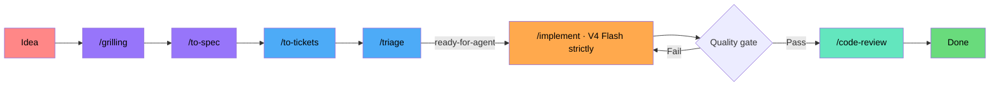

# AI Coding Workflow

Inspired by **Matt Pocock's** skills -- AI Engineering/ Coding??? lol. Runs on **OpenCode Go** with [`mattpocock/skills`](https://github.com/mattpocock/skills). Flash-first routing: **V4 Flash is the default for every stage** — escalate only on concrete failure. (0810: grilling-first pipeline)

---

## The Main Pipeline

```
idea → grilling → to-spec → to-tickets → triage → implement → code-review
```



Every fuzzy idea gets grilled into shape, written into a spec, sliced into tickets, triaged for agent-readiness, implemented, and reviewed. Triage's other states (`ready-for-human`, `wontfix`, `needs-info`) exit or loop back.

## Agents

Use the **`build`** agent for everything (`opencode run --agent build`). `plan` is too restricted — it can't write CONTEXT.md/ADRs/tickets or spawn `general` subagents.

---

## Stages

### grilling — the front door
Interview in rounds over a **design tree** (every decision branches into the decisions hanging off it).
- Each round asks the whole **frontier** — decisions whose prerequisites are settled — numbered, with a recommended answer each
- **Facts are the agent's job** (dispatch sub-agents); decisions are yours
- Done when the frontier is empty: no silent assumptions left
- `grill-me` = alias · `grill-with-docs` = grilling + `/domain-modeling` (writes ADRs + CONTEXT.md glossary as decisions land)

Routing: Flash → **GLM 5.2 / Qwen3.8 Max** if shallow

### to-spec — write it down
Synthesizes the grill — do **NOT** re-interview.
1. Sketches the test seams first, confirms them with you (existing seams, highest, ideally one)
2. Writes: Problem → Solution → User Stories → Implementation Decisions → Testing Decisions → Out of Scope
3. Publishes per tracker (`.scratch/<slug>/spec.md` or a real issue), applies `ready-for-agent`

Routing: Flash → **GLM 5.2 / Qwen3.8 Max** if it misses nuance

### to-tickets — slice into tracer bullets
Vertical slices through every layer (schema → API → logic → tests → UI), each demoable alone, sized for one context window, blocking edges declared.
- Quizzes you on granularity before publishing
- Publishes `.scratch/<slug>/issues/<NN>-<slug>.md` (01+, blockers first, `Status: ready-for-agent`) or native blocking links
- Wide refactors → **expand–contract**, not slices

Routing: Flash

### triage — the gate
State machine: `needs-triage` → `needs-info` | `ready-for-agent` | `ready-for-human` | `wontfix`, + category (`bug` / `enhancement`).
- `ready-for-agent` = the handoff into implement; other states exit or loop
- Also the door for external issues/PRs (a PR is an issue with attached code)
- Redundancy + `.out-of-scope/` prior-rejection checks → verify the claim → grill if needed
- Tracker comments prefixed `> *This was generated by AI during triage.*`

Routing: Flash → max effort if misclassifying

### implement — the build
`/tdd` at pre-agreed seams → typecheck regularly → full suite → `/code-review` → commit.

Routing: **Flash strictly** — max effort only, never a model switch

### code-review — the gate out
Reviews `fixed-point...HEAD` (your commit/branch/tag, three-dot vs merge-base) on two parallel axes:
- **Standards** — repo standards + Fowler smell baseline
- **Spec** — matches the originating spec (from commit refs, a path, or `.scratch/`)

Reports stay separate — no reranking. Discuss findings, then `/implement` the agreed fixes and loop until clean.

Routing: Flash → **MiMo V2.5 Pro / MiniMax M3** if thin

---

## Supporting Skills

- **tdd** — red→green at pre-agreed seams; no horizontal slicing, no tautological/impl-coupled tests
- **domain-modeling** — CONTEXT.md glossary + ADRs; engine behind grill-with-docs; ADRs only when hard-to-reverse + surprising + real trade-off
- **diagnosing-bugs** — 6 phases: red-capable loop → reproduce+minimise → 3–5 ranked falsifiable hypotheses (shown to you) → instrument → fix+regression (no correct seam = the finding) → cleanup+post-mortem
- **research** — delegated fact-finding; resolves wayfinder research tickets
- **prototype** — throwaway artifact for "how should it look/behave"; one command, no persistence, no polish
- **handoff** — compacts the conversation to OS temp for a fresh agent, with a suggested-skills section; redacts secrets
- **improve-codebase-architecture** — arch scan → visual HTML report; also diagnosing-bugs phase-6 handoff target

## Wayfinder — grilling, scaled up

For work too big for one session: a **map** (`wayfinder:map` issue) of **decision tickets** (research / prototype / grilling / task) — questions whose resolution is a decision, not a build slice. The map is an index, not a store.
- Chart via grilling + domain-modeling; name the **destination** first
- Claim a ticket by assignment before working it; frontier = open + unblocked + unclaimed
- Native blocking edges; fog of war → "Not yet specified", graduates as the frontier advances; out-of-scope never graduates
- One ticket per session (research excepted); refer by name, never bare id

Routing: chart Flash → max effort if map wrong · grilling tickets Flash → GLM 5.2 / Qwen3.8 Max if stalled

## Alternate Paths

| Path | Flow | Est. cost |
|------|------|-----------|
| New project | full pipeline | ~$0.04–0.13 |
| Feature add | idea → light grill → implement → review (cross-cutting: implement at max effort) | ~$0.03–0.08 |
| Bug fix | diagnosing-bugs → review → discuss → implement → loop | ~$0.05–0.18 |
| Arch redesign | scan → spec → tickets → implement → review | ~$0.08–0.25 |
| Prototype | prototype → iterate | ~$0.01 |

## First-time setup (per repo)

Run `/setup-matt-pocock-skills` once per repo: pick tracker (GitHub / GitLab / local `.scratch/`), triage labels, domain docs → writes `docs/agents/*.md` + an `## Agent skills` block in AGENTS.md / CLAUDE.md.

## Routing Feedback

Escalations are data. Track per task type; update the routing tables when: 3+ same-type escalations in 2 weeks, a routed model gets deprecated, or a model at Flash prices beats Flash. Stale routing is worse than no routing.

---

<details>
<summary><strong>Routing & Models</strong> — expand</summary>

**Escalation** (thinking stages step up; volume stages stay Flash):

| Stage | Escalate to |
|-------|-------------|
| grilling, to-spec | GLM 5.2 or Qwen3.8 Max |
| prototype | GLM 5.2 |
| implement, tdd | **V4 Flash, strictly** — max effort only |
| code-review | MiMo V2.5 Pro or MiniMax M3 |
| diagnosing-bugs | GLM 5.2 (max effort) or Qwen3.8 Max |
| everything else | Max effort on V4 Flash |

Rule of thumb: volume stages (implement, tdd) burn the most tokens — keep them on Flash; spend escalations on thinking stages (grilling, spec, debugging, review). A simple feature costs ~$0.04 vs ~$0.42 with the old model-per-stage routing.

**Model Reference** (pricing via OpenCode Go; Req/5h = est. requests per 5-hour window)

| Model | Input $/1M | Output $/1M | Req/5h | Req/mo | Context | Key Strength |
|---|---|---|---|---|---|---|
| **Qwen3.7 Max** | $2.50 | $7.50 | 950 | 4,770 | 1M | Highest SWE-bench Pro on Go (60.6%). Best for hard planning. |
| **Qwen3.8 Max** | $2.00 | $6.00 | — | — | 1M | New Aug 2026. Multimodal. Escalation target for grill/spec/debugging. |
| **DeepSeek V4 Pro** | $0.435 | $0.87 | 3,450 | 17,150 | 1M | LiveCodeBench 93.5%, Codeforces 3206. Strongest for implementation. |
| **Kimi K2.6** | $0.95 | $4.00 | 1,150 | 5,750 | 262K | Agent Swarm (300 sub-agents). Agentic multi-file changes. |
| **Kimi K2.7 Code** | $0.95 | $4.00 | 1,350 | 6,750 | 256K | Coding-focused. More requests than K2.6. Solid mid-tier planner. |
| **DeepSeek V4 Flash** | $0.14 | $0.28 | **31,650** | 158,150 | 1M | **Default workhorse.** 79% SWE-bench Verified. Cheap. Fast. |
| **MiMo V2.5** | $0.14 | $0.28 | 30,100 | 150,400 | 1M | Budget workhorse. Same price as Flash, 1M context. |
| **MiniMax M2.7** | $0.30 | $1.20 | 3,400 | 17,000 | 205K | Strong cost-per-benchmark-point (78% SWE-bench Verified). |
| **Grok 4.5** | $2.00 | $6.00 | 120 | 600 | 1M | xAI's latest. Fast reasoning, large context. |
| **GLM-5.2** | $1.40 | $4.40 | 880 | 4,300 | 1M | Zhipu flagship. Strong bilingual coding (CN/EN). |
| **GLM-5.1** | $1.40 | $4.40 | 880 | 4,300 | 128K | Solid all-rounder from Zhipu. |
| **Kimi K3** | $3.00 | $15.00 | 110 | 490 | 128K | Moonshot's coding specialist. High output cost — use sparingly. |
| **MiMo V2.5 Pro** | $0.435 | $0.87 | 3,250 | 16,300 | 1M | Upgraded MiMo. Same price tier as V4 Pro, lower request cap. |
| **MiniMax M3** | $0.30 | $1.20 | 3,200 | 16,000 | 1M | MiniMax's latest. Improved over M2.7 at same price. |
| **Qwen3.7 Plus** | $0.40 | $1.60 | 4,300 | 21,600 | 1M | Strong mid-tier Qwen. Good balance of cost and quality. |
| **Qwen3.6 Plus** | $0.50 | $3.00 | 3,300 | 16,300 | 256K | Earlier Qwen gen at mid-range pricing. Solid reasoning. |
| **Hy3** | $0.14 | $0.58 | 4,300 | 21,500 | 128K | Budget model. High throughput at Flash-like input pricing. |

**Model Route Quick Reference**

| Task Type | Default | Escalation | Agent | Est. req |
|-----------|---------|------------|-------|----------|
| Triage | V4 Flash | Max effort | build | 1-2 |
| Grilling (incl. grill-with-docs) | V4 Flash | GLM 5.2 / Qwen3.8 Max if shallow | build | 3-8 |
| Planning / spec (new project) | V4 Flash | GLM 5.2 / Qwen3.8 Max | build | 1-3 |
| Tickets | V4 Flash | — | build | 3-5 |
| Implementation (simple) | V4 Flash | — | build | 3-8 |
| Implementation (complex) | V4 Flash | Max effort only — no model switch | build | 5-15 |
| Debugging | V4 Flash | GLM 5.2 (max effort) / Qwen3.8 Max | build | 10-50 |
| Architecture scan (light) | V4 Flash | Max effort if shallow | build | 1-2 |
| Architecture scan (deep w/ grill loop) | V4 Flash | Max effort if shallow | build | 3-6 |
| Prototype | V4 Flash / MiMo | GLM 5.2 | build | 5-20 |
| Code review | V4 Flash | MiMo V2.5 Pro / MiniMax M3 | build | 2-4 |
| Research | V4 Flash | — | build | 2-5 |
| Handoff | V4 Flash | — | build | 1 |
| Wayfinder (map) | V4 Flash | Max effort if map is wrong | build | 1-3 |
| Wayfinder (re-chart) | V4 Flash | Max effort (rare) | build | 1-2 |
| Wayfinder (tickets) | V4 Flash | — | build | 3-10+ |

</details>

---

<details>
<summary><strong>Budget Tracking</strong> — expand</summary>

$60/month. A typical feature cycle costs ~**$0.04–0.25** → **240–1,500 features/month** if you route correctly.

| Routing strategy | Features/month (max) |
|---|---|
| **Flash for everything (this guide)** | **~240–1,500** |
| Balanced (per-stage model pinning, pre-0731) | ~60–120 |
| Max effort on every call | ~200+ (slower, same token cost) |

Max-effort escalation costs the same per token — the only price is latency. Model escalations (GLM 5.2, Qwen3.8 Max) cost more per token but are rare by design. The $40–50 buffer covers even heavy months (multiple architecture scans, wayfinders, bug fixes).

</details>

---

## Learning & Iteration

This is for me to document my workflow plan so things will change over time~. Models on Go... tools I have access too.. local models??! new models??! subscriptions??!.

0810: reorganized around the grilling-first pipeline; triage moved from front door to gate-before-implement; wayfinder = scaled-up grilling; added handoff/research, the `.scratch/` convention, and per-repo setup. Mechanics verified against `mattpocock/skills` @ main (Aug 2026).

0805: per-stage escalation — thinking stages step up (GLM 5.2, Qwen3.8 Max, MiMo V2.5 Pro, MiniMax M3), /implement stays strictly Flash. Open question: do any stages deserve a model above the current escalation targets (gpt-5.6-luna just landed on Go)? Revisit as the lineup grows.

Also in upstream, not yet adopted: to-questionnaire, wait-what, ask-matt, teach, wizard, writing-for-agents.
