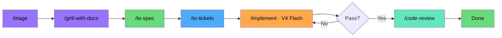
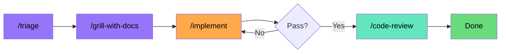
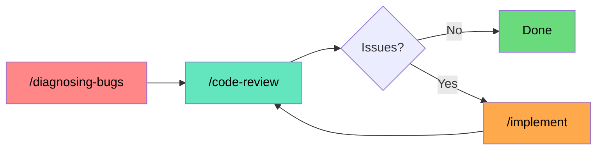
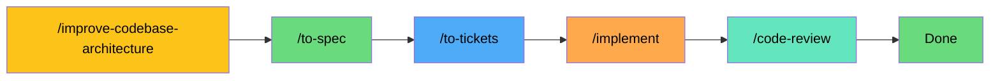
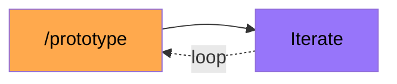
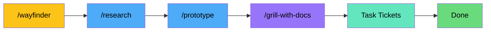

# AI Coding Workflow

Inspired by **Matt Pocock's** skills -- AI Engineering/ Coding??? lol.

Uses **OpenCode Go**.
All skills from [`mattpocock/skills`](https://github.com/mattpocock/skills).

---

## Routing Philosophy

**V4 Flash is the default for everything.** It scores 79% SWE-bench Verified, has 1M context, costs $0.14/$0.28 per million tokens, and has 31,650 req/5h — effectively unlimited. Since the 0731 update it handles *every* stage of *every* pipeline — including architecture scans and wayfinding that used to be pinned to pricier models.

**Escalate only when Flash proves insufficient.** Since the 0805 update, escalation is per-stage: the thinking stages step up to a premium model, while the high-volume code-writing stages stay strictly on Flash. Don't pre-assign expensive models to stages based on what the stage *could* need — wait for a concrete failure, then rerun that stage on its escalation target.

| Stage | Escalate to |
|-------|-------------|
| /grill-with-docs, /to-spec | GLM 5.2 or Qwen3.8 Max |
| /prototype | GLM 5.2 |
| /implement, /tdd | **V4 Flash, strictly** — max effort only, never a model switch |
| /code-review | MiMo V2.5 Pro or MiniMax M3 |
| /diagnosing-bugs | GLM 5.2 (max effort) or Qwen3.8 Max |
| Everything else | Max effort on V4 Flash (unchanged) |

Rule of thumb: the volume stages (implement, tdd) burn the most tokens — keep them on Flash. Spend escalations on the thinking stages (interview, spec, debugging, review), where a smarter model pays for itself.

The savings are dramatic: ~$0.04 for a simple feature vs ~$0.42 with the old model-per-stage routing. You stay safely within the $60/month budget even on heavy months.

---

## OpenCode Agents

Uses the **`build`** agent via `opencode run --agent build` for everything. It has full tool access (read, edit, bash, subagents) and can handle every stage — planning docs, writing code, spawning research subagents, everything.

The **`plan`** agent exists but is too restricted for this skill set: it can't write CONTEXT.md, ADRs, ticket files, or spawn `general` subagents for delegated work. So `build` is the default for all stages.

---

<details>
<summary><strong>Pipeline Diagrams</strong> — click to expand</summary>

### 1. NEW PROJECT (from scratch)



Start with `/triage` to categorize and route the ask. It runs a small state machine: `needs-triage` → `needs-info` (if ambiguous) → `ready-for-agent` or `ready-for-human`. Category labels (`bug`/`enhancement`) are set upfront. For PRs, the same states apply but read against the attached code. `/grill-with-docs` interviews you about the domain, builds CONTEXT.md. `/to-spec` formalizes what was discussed. `/to-tickets` breaks it into vertical-slice tickets with blocking edges. `/implement` writes the code — strictly V4 Flash (max effort only, no model switch). `/code-review` checks standards and spec compliance (escalate to MiMo V2.5 Pro / MiniMax M3 if it comes back thin).

### 2. ADDING A FEATURE



A lighter pipeline. `/triage` and `/grill-with-docs` research the existing codebase to understand context. Skip spec and tickets — you're extending what's there, not starting fresh. `/implement` writes the feature on V4 Flash, then `/code-review` checks it. For cross-cutting changes touching 3+ modules, rerun `/implement` at max effort — still V4 Flash, no model switch.

### 3. BUG FIX



`/diagnosing-bugs` is a single prompt that drives the entire debug cycle on V4 Flash. If the fix keeps failing, escalate to GLM 5.2 at max effort or Qwen3.8 Max. Review with `/code-review` (escalate to MiMo V2.5 Pro / MiniMax M3 if thin), then **discuss any issues it raises** — after that, `/implement` the agreed fixes (strictly Flash) and loop until clean.

### 4. ARCHITECTURE REDESIGN



`/improve-codebase-architecture` scans the codebase for deepening opportunities and generates an HTML report — V4 Flash by default since the 0731 update (used to be pinned to a pricier model; only crank to max effort if the scan comes back shallow). `/to-spec` formalizes the plan. `/to-tickets` slices into work items. `/implement` on V4 Flash, max effort if the change outgrows it. `/code-review` to confirm.

### 5. PROTOTYPE / SPIKE



`/prototype` generates throwaway code to answer a design question. V4 Flash or MiMo V2.5 — speed over quality. Escalate to GLM 5.2 if Flash/MiMo can't crack the design question. Iterate with the same cheap model until you have your answer. No spec, no review — this is learning, not shipping.

### 6. WAYFINDER (complex project, multiple sessions)



For projects too big for one agent session. Creates a **map** of decision tickets on the issue tracker — not build tickets, but questions whose resolution is a decision that unblocks the path forward.

**How it works:**
- **Charting** — `/wayfinder` (V4 Flash; max effort only if the map comes out wrong) names the destination, identifies what's known vs fog, and creates the initial tickets. The map is a single issue with: Destination, Notes, Decisions so far, Not yet specified (fog of war), Out of scope.
- **Frontier** — tickets graduate from "fog" (not yet specified) into concrete decision tickets as the frontier advances. Each ticket is sized for one 100K-token agent session.
- **Resolution** — each ticket is resolved independently by a V4 Flash sub-agent. A ticket closes when its question is answered (not when code is written), producing a decision recorded in the map's "Decisions so far" section.
- **Done** — the map is complete when the way is clear: no decisions left to make before someone can go build the thing. The output is a handoff (spec, decision log, or change made in place), not a delivery.

Everything after charting runs on V4 Flash sub-agents: research tickets, prototype tickets, grilling tickets, task tickets. Only a map re-chart (when the destination shifts or the frontier reveals the initial map was wrong) runs at max effort.

</details>

---

<details>
<summary><strong>Model Reference</strong> — click to expand pricing table</summary>

Pricing via OpenCode Go. "Req/5h" = estimated requests per 5-hour rolling window.

| Model | Input $/1M | Output $/1M | Req/5h | Req/mo | Context | Key Strength |
|---|---|---|---|---|---|---|
| **Qwen3.7 Max** | $2.50 | $7.50 | 950 | 4,770 | 1M | Highest SWE-bench Pro on Go (60.6%). Best for hard planning. |
| **Qwen3.8 Max** | $2.00 | $6.00 | — | — | 1M | New Aug 2026. Multimodal (text/image/video). Escalation target for grill/spec/debugging. |
| **DeepSeek V4 Pro** | $0.435 | $0.87 | 3,450 | 17,150 | 1M | LiveCodeBench 93.5%, Codeforces 3206. Strongest for implementation. |
| **Kimi K2.6** | $0.95 | $4.00 | 1,150 | 5,750 | 262K | Agent Swarm (300 sub-agents). Best for agentic multi-file changes. |
| **Kimi K2.7 Code** | $0.95 | $4.00 | 1,350 | 6,750 | 256K | Coding-focused model. More requests than K2.6. Solid mid-tier planner. |
| **DeepSeek V4 Flash** | $0.14 | $0.28 | **31,650** | 158,150 | 1M | **Default workhorse.** 79% SWE-bench Verified. Cheap. Fast. |
| **MiMo V2.5** | $0.14 | $0.28 | 30,100 | 150,400 | 1M | Budget workhorse. Same price as Flash, 1M context. |
| **MiniMax M2.7** | $0.30 | $1.20 | 3,400 | 17,000 | 205K | Strong cost-per-benchmark-point (78% SWE-bench Verified at $0.30). |
| **Grok 4.5** | $2.00 | $6.00 | 120 | 600 | 1M | xAI's latest. Fast reasoning, large context. |
| **GLM-5.2** | $1.40 | $4.40 | 880 | 4,300 | 1M | Zhipu flagship. Strong bilingual coding (CN/EN). |
| **GLM-5.1** | $1.40 | $4.40 | 880 | 4,300 | 128K | Solid all-rounder from Zhipu. |
| **Kimi K3** | $3.00 | $15.00 | 110 | 490 | 128K | Moonshot's coding specialist. High output cost — use sparingly. |
| **MiMo V2.5 Pro** | $0.435 | $0.87 | 3,250 | 16,300 | 1M | Upgraded MiMo. Same price tier as V4 Pro, lower request cap. |
| **MiniMax M3** | $0.30 | $1.20 | 3,200 | 16,000 | 1M | MiniMax's latest. Improved over M2.7 at same price. |
| **Qwen3.7 Plus** | $0.40 | $1.60 | 4,300 | 21,600 | 1M | Strong mid-tier Qwen. Good balance of cost and quality. |
| **Qwen3.6 Plus** | $0.50 | $3.00 | 3,300 | 16,300 | 256K | Earlier Qwen gen at mid-range pricing. Solid reasoning. |
| **Hy3** | $0.14 | $0.58 | 4,300 | 21,500 | 128K | Budget model. High throughput at Flash-like input pricing. |

</details>

---

## Pipeline: Use Case & Routing

### 1. NEW PROJECT (from scratch)


| Stage | Default | Escalation | Agent | Why |
|-------|---------|------------|-------|-----|
| **Triage** | V4 Flash | Max effort if misclassifies consistently | build | Routes through state machine (needs-triage → ready-for-agent/human). Greenfield has no codebase, so it's cheap. |
| **Interview** | V4 Flash | GLM 5.2 / Qwen3.8 Max if grill comes back shallow | build | Domain conversation, no codebase research. Flash handles this fine; escalate when CONTEXT.md stays fuzzy. |
| **Spec** | V4 Flash | GLM 5.2 / Qwen3.8 Max if it misses nuance | build | Synthesis of existing conversation. Pure formatting; escalate when nuance slips. |
| **Tickets** | V4 Flash | — | build | Mechanical breakdown. |
| **Implement (simple)** | V4 Flash | — | build | Single file, straightforward logic. |
| **Implement (complex)** | V4 Flash | Max effort if fails quality gates — no model switch | build | Strictly Flash. The only escalation is more reasoning effort, same model. |
| **Code Review** | V4 Flash | MiMo V2.5 Pro / MiniMax M3 if review is thin | build | Read diffs, check standards. Escalate when the review misses real issues. |

**Est. cost:** simple ~**$0.04** | complex ~**$0.13**

---

### 2. ADDING A FEATURE


| Stage | Default | Escalation | Agent | Why |
|-------|---------|------------|-------|-----|
| **Triage** | V4 Flash | Max effort if triage consistently misclassifies | build | Codebase reading — Flash can do it. |
| **Interview** | V4 Flash | GLM 5.2 / Qwen3.8 Max if grill produces shallow CONTEXT.md | build | Codebase exploration. Start Flash, escalate if shallow. |
| **Implement (simple)** | V4 Flash | — | build | Small change in existing patterns. |
| **Implement (cross-cutting)** | V4 Flash | Max effort if it can't hold the scope — no model switch | build | Complex change. Strictly Flash; max effort if it loses the plot. |
| **Code Review** | V4 Flash | MiMo V2.5 Pro / MiniMax M3 if thin | build | Review pass. Escalate when the review misses real issues. |

**Est. cost:** simple ~**$0.03** | cross-cutting ~**$0.08**

---

### 3. BUG FIX


`/diagnosing-bugs` is a single prompt that drives the entire debug cycle on V4 Flash. If the fix keeps failing tests, escalate to GLM 5.2 at max effort or Qwen3.8 Max. Review with `/code-review` (escalate to MiMo V2.5 Pro / MiniMax M3 if thin), then **discuss any issues it raises** — after that, `/implement` the agreed fixes (strictly Flash) and loop until clean.

| Stage | Default | Escalation | Agent | Why |
|-------|---------|------------|-------|-----|
| **Diagnose & fix** | V4 Flash | GLM 5.2 (max effort) or Qwen3.8 Max if fix fails | build | Single prompt handles the whole debug cycle. Flash is fast and cheap for iteration; escalate when the fix keeps failing. |
| **Review → discuss → implement** | V4 Flash | Review: MiMo V2.5 Pro / MiniMax M3. Implement: strictly Flash. | build | `/code-review` finds issues → discuss them → `/implement` the agreed fixes → loop until clean. |

**Est. cost:** easy ~**$0.05** | hard ~**$0.18**

---

### 4. ARCHITECTURE REDESIGN


| Stage | Default | Escalation | Agent | Why |
|-------|---------|------------|-------|-----|
| **Architecture scan** | V4 Flash | Max effort if scan is shallow | build | Produces an HTML report of deepening opportunities. Flash handles it now (0731 update); crank effort if it misses depth. |
| **Spec** | V4 Flash | GLM 5.2 / Qwen3.8 Max if it misses nuance | build | Synthesis of scan output, not new reasoning. |
| **Tickets** | V4 Flash | — | build | Breaking into tickets is mechanical. |
| **Implement** | V4 Flash | Max effort for large-scale changes — no model switch | build | Strictly Flash; max effort when the change needs deeper reasoning. |
| **Code Review** | V4 Flash | MiMo V2.5 Pro / MiniMax M3 if thin | build | Review pass. |

**Est. cost:** light ~**$0.08** | deep ~**$0.25**

---

### 5. PROTOTYPE / SPIKE


Throwaway code that answers a question. Speed over quality. Don't burn expensive models here.

| Stage | Model | Agent | Why |
|-------|-------|-------|-----|
| **Prototype** | **V4 Flash** or **MiMo V2.5** → **GLM 5.2** if stuck | build | ~30,000 req/5h = unlimited. MiMo gives 1M context at same price. Escalate to GLM 5.2 for hard design questions. |
| **Iterate** | Same | build | |

**Est. cost:** ~**$0.01**

---

### 6. WAYFINDER (complex project, multiple sessions)


For projects too big for one agent session. Creates a **map** of decision tickets on the issue tracker. Not build tickets — questions whose resolution unblocks the path forward.

The map is a single issue with: Destination, Notes, Decisions so far, Not yet specified (fog of war), Out of scope. Tickets graduate from fog → concrete as the frontier advances. Each ticket is sized for one 100K-token agent session and resolved independently. The map is done when the way is clear — no decisions left before someone can go build the thing. Only a re-chart (destination shift or wrong initial map) runs at max effort.

| Stage | Default | Escalation | Agent | Why |
|-------|---------|------------|-------|-----|
| **Chart the map** | V4 Flash | Max effort only if the initial map is wrong | build | Name the destination, surface fog, create the initial tickets. Flash is enough since the 0731 update. |
| **Re-chart** | V4 Flash | Max effort (rare) | build | Destination shifted or the initial map was wrong. Rare — only when frontier reveals a fundamentally incorrect map. |
| **Research tickets** | V4 Flash | — | build | Read docs, investigate APIs. High volume, cheap. |
| **Prototype tickets** | V4 Flash | — | build | Throwaway code to answer design questions. |
| **Grilling tickets** | V4 Flash | GLM 5.2 / Qwen3.8 Max if a session stalls | build | Conversation to sharpen decisions one at a time. |
| **Task tickets** | V4 Flash | — | build | Mechanical setup work. |

**Est. cost:** ~**$0.15-0.30**

---

## Prompt Guidance Per Stage

### `/grill-with-docs` — The Interview

```
/grill-with-docs interview me about [FEATURE].
I want to understand the domain, the problem, and what a good solution looks like.
```

Matt's skill:
1. Explores codebase first (understand current state)
2. Uses `/domain-modeling` to challenge fuzzy terms — when you say "user", do you mean Customer or Account Holder?
3. Writes terms to `CONTEXT.md` as they crystallize (not batched)
4. Offers ADRs sparingly — only when **hard to reverse + surprising + real trade-off**

If the grill comes back shallow (fuzzy CONTEXT.md, unresolved domain terms), rerun at max effort or escalate to **GLM 5.2 / Qwen3.8 Max**.

### `/to-spec` — From Conversation to Spec

Synthesizes what you already discussed -- don't re-interview. Produces 6 sections:

1. **Problem Statement** — user's perspective
2. **Solution** — user's perspective
3. **User Stories** — extensive numbered list (As a <actor>, I want <feature>, so that <benefit>)
4. **Implementation Decisions** — modules, interfaces, schemas, API contracts (no file paths/code snippets)
5. **Testing Decisions** — seams, what makes a good test
6. **Out of Scope** — explicitly what's NOT being built

Escalate to **GLM 5.2 / Qwen3.8 Max** if the spec misses nuance.

### `/to-tickets` — Breaking into Tickets

Each ticket is a **tracer bullet** — vertical slice through every layer:
- Schema → API → Logic → Tests → UI
- Each slice demoable on its own
- Sized for one fresh context window
- Blocking edges declared

### `/implement` — Writing Code

- Runs tests via `/tdd` at pre-agreed seams
- Typechecking as you go
- Single test files as you go
- Full test suite at the end
- Auto-runs `/code-review` when done
- Commits to current branch

**Strictly V4 Flash.** This is the highest-volume stage — the only escalation is max effort, never a model switch.

### `/code-review` -- Two-Axis Review

```
/code-review review since main
```

Runs **two parallel sub-agents**:
- **Standards** -- does the code follow documented standards and avoid Fowler code smells?
- **Spec** -- does the code match what the issue asked for?

They report independently. A change can pass one axis and fail the other.

Escalate to **MiMo V2.5 Pro or MiniMax M3** if the review comes back thin or misses real issues.

### `/diagnosing-bugs` — Debug Cycle

`/diagnosing-bugs` is a single prompt that drives the entire debug cycle on V4 Flash. It builds a repro, diagnoses the root cause, writes a regression test, and applies the fix in one shot.

Then: `/code-review` → **discuss any issues** → `/implement` the agreed fixes → loop until clean. If the fix keeps failing tests, escalate to **GLM 5.2 at max effort** or **Qwen3.8 Max**.

| If someone says "it doesn't work" | Don't jump to hypothesizing |
|----------------------------------|------------------------------|

Build a tight red/green feedback loop before anything else. A 2-second deterministic repro changes everything. A 30-second flaky repro is barely useful.

---

## Routing Feedback

Escalations are data. If a task type keeps requiring escalation, the routing table should evolve.

**Track escalations per task type.** After each project or sprint, note which tasks escalated and to which effort level:

```
Task: cross-cutting feature-add to auth module
Escalated: /implement → max effort (structural failure)
Pattern: 3rd time in 2 weeks
Action: bump default for auth-scoped work to start at max effort
```

**When to update the routing table:**
- 3+ escalations of the same type in 2 weeks → change the default effort for that task type
- A model you're routing to gets deprecated or replaced → update immediately
- A new model at Flash prices outperforms Flash on your workload → swap the default
- A new model makes max effort obsolete → adopt it as the new default

**Keep it live.** This is a workflow doc — stale routing is worse than no routing. If a model gets better or cheaper, the defaults here should follow. The escalation table at the top is the first thing to touch when patterns emerge.

---

<details>
<summary><strong>Model Route Quick Reference</strong> — click to expand</summary>

| Task Type | Default | Escalation | Agent | Est. req |
|-----------|---------|------------|-------|----------|
| Triage | V4 Flash | Max effort | build | 1-2 |
| Codebase research / grill | V4 Flash | GLM 5.2 / Qwen3.8 Max if shallow | build | 3-8 |
| Planning / spec (new project) | V4 Flash | GLM 5.2 / Qwen3.8 Max | build | 1-3 |
| Tickets | V4 Flash | — | build | 3-5 |
| Implementation (simple) | V4 Flash | — | build | 3-8 |
| Implementation (complex) | V4 Flash | Max effort only — no model switch | build | 5-15 |
| Debugging | V4 Flash | GLM 5.2 (max effort) / Qwen3.8 Max | build | 10-50 |
| Architecture scan (light) | V4 Flash | Max effort if shallow | build | 1-2 |
| Architecture scan (deep w/ grill loop) | V4 Flash | Max effort if shallow | build | 3-6 |
| Prototype | V4 Flash / MiMo | GLM 5.2 | build | 5-20 |
| Code review | V4 Flash | MiMo V2.5 Pro / MiniMax M3 | build | 2-4 |
| Wayfinder (map) | V4 Flash | Max effort if map is wrong | build | 1-3 |
| Wayfinder (re-chart) | V4 Flash | Max effort (rare) | build | 1-2 |
| Wayfinder (tickets) | V4 Flash | — | build | 3-10+ |

</details>

---

<details>
<summary><strong>Budget Tracking</strong> — click to expand</summary>

$60/month. A typical feature cycle costs ~**$0.04-0.25** with the Flash-for-everything routing.
That's **240-1,500 features per month** if you route correctly.

| Routing strategy | Features/month (max) |
|---|---|
| **Flash for everything (this guide)** | **~240-1,500** |
| Balanced (per-stage model pinning, pre-0731) | ~60-120 |
| Max effort on every call | ~200+ (slower, same token cost) |

Escalation to max effort costs the same per token as normal Flash — the only price is latency, not dollars. Model escalations (GLM 5.2 $1.40/$4.40, Qwen3.8 Max $2.00/$6.00) cost more per token but are rare by design — they're the exception, not the default. The buffer is large enough ($40-50/month) that even heavy months with multiple architecture scans, wayfinders, and bug fixes won't break the budget.

</details>

---

## Learning & Iteration

This is for me to document my workflow plan so things will change over time~. Models on Go... tools I have access too.. local models??! new models??! subscriptions??!.

0805 update: escalation is now per-stage model switching — thinking stages step up (GLM 5.2, Qwen3.8 Max, MiMo V2.5 Pro, MiniMax M3), /implement stays strictly on V4 Flash. Open question: do any stages deserve a model above the current escalation targets (gpt-5.6-luna just landed on Go)? Revisit as the lineup grows.
