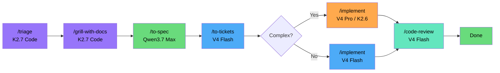
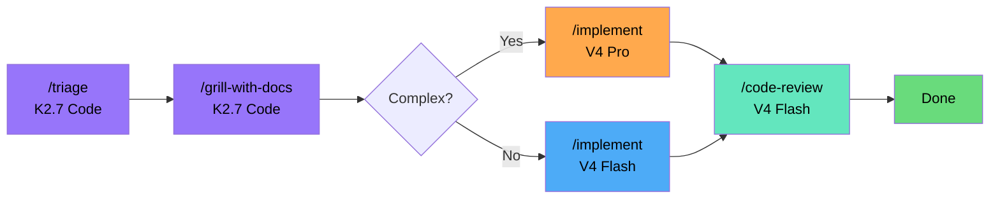
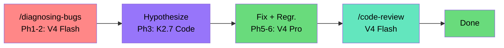
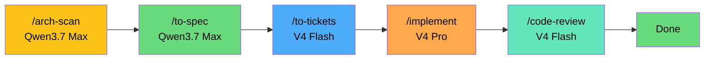
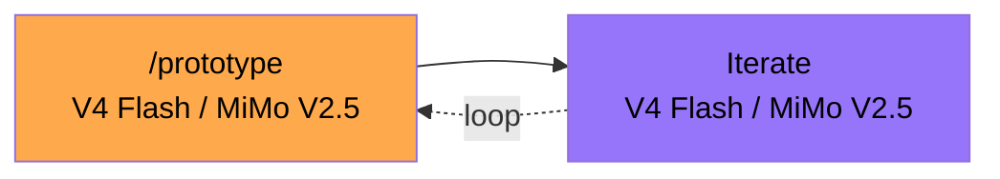

# AI Coding Workflow

Inspired by **Matt Pocock's** skills -- real engineering, not vibe coding.

Uses **OpenCode Go**.
All skills from [`mattpocock/skills`](https://github.com/mattpocock/skills).

---

## Pipeline Diagrams

### 1. NEW PROJECT (from scratch)



Start with `/triage` to categorize the ask. `/grill-with-docs` interviews you about the domain, builds CONTEXT.md. `/to-spec` formalizes what was discussed. `/to-tickets` breaks it into vertical-slice tickets with blocking edges. `/implement` writes the code -- V4 Flash for simple, V4 Pro or K2.6 for complex. `/code-review` checks standards and spec compliance.

### 2. ADDING A FEATURE



A lighter pipeline. `/triage` and `/grill-with-docs` research the existing codebase to understand context. Skip spec and tickets -- you're extending what's there, not starting fresh. `/implement` writes the feature, then `/code-review` checks it.

### 3. BUG FIX



`/diagnosing-bugs` runs the 6-phase loop. Phase 1 builds a tight repro (V4 Flash, iterate cheap). Phase 2 minimizes it. Phase 3 generates ranked hypotheses (K2.7 Code for reasoning). Phase 4 instruments. Phase 5 writes the fix and regression test (V4 Pro for correctness). Phase 6 cleans up debug tags and commits. Review with `/code-review`.

### 4. ARCHITECTURE REDESIGN



`/improve-codebase-architecture` scans the codebase for deepening opportunities and generates an HTML report (Qwen3.7 Max for deep reasoning). `/to-spec` formalizes the plan, `/to-tickets` slices into work items. `/implement` with V4 Pro handles large-scale changes (needs 1M context). `/code-review` to confirm.

### 5. PROTOTYPE / SPIKE



`/prototype` generates throwaway code to answer a design question. Pick a branch -- logic prototype (state machine test) or UI prototype (multiple visual variants). Iterate with the same cheap model (V4 Flash or MiMo V2.5) until you have your answer. No spec, no review -- this is learning, not shipping.

---

## Model Reference

Pricing via OpenCode Go. "Req/5h" = estimated requests per 5-hour rolling window.

| Model | Input $/1M | Output $/1M | Req/5h | Req/mo | Context | Key Strength |
|---|---|---|---|---|---|---|
| **Qwen3.7 Max** | $2.50 | $7.50 | 950 | 4,770 | 1M | Highest SWE-bench Pro on Go (60.6%). Best for hard planning. |
| **DeepSeek V4 Pro** | bundled | bundled | 3,450 | 17,150 | 1M | LiveCodeBench 93.5%, Codeforces 3206. Strongest for implementation. |
| **Kimi K2.6** | $0.95 | $4.00 | 1,150 | 5,750 | 256K | Agent Swarm (300 sub-agents). Best for agentic multi-file changes. |
| **Kimi K2.7 Code** | $0.95 | $4.00 | 1,350 | 6,750 | 256K | Coding-focused model. More requests than K2.6. Solid mid-tier planner. |
| **DeepSeek V4 Flash** | $0.14 | $0.28 | **31,650** | 158,150 | 1M | Default workhorse. 79% SWE-bench Verified. Cheap. Fast. |
| **MiMo V2.5** | $0.14 | $0.28 | 30,100 | 150,400 | 1M | Budget workhorse. Same price as Flash, 1M context. |
| **MiniMax M2.5** | $0.30 | $1.20 | 6,300 | 31,500 | 205K | Best cost-per-benchmark-point (80.2% at $0.30). |

---

## Pipeline: Use Cases & Stage-Specific Routing

### 1. NEW PROJECT (from scratch)


| Stage | Command | Agent | **Model** | Why | Est. req | Est. cost |
|---|---|---|---|---|---|---|
| **Triage** | `/triage` | Plan | **K2.7 Code** | Categorizing, reading issues. Needs instruction-following, not max reasoning. | 1-2 | ~$0.06 |
| **Interview** | `/grill-with-docs` | Plan | **K2.7 Code** | Research-heavy: read docs, ask questions, explore codebase, build CONTEXT.md. No code written. | 3-8 | ~$0.25 |
| **Spec** | `/to-spec` | Plan | **Qwen3.7 Max** | Pulls everything from the interview into a formal spec. You want the best reasoning here — 60.6% SWE-bench Pro. | 1-2 | ~$0.08 |
| **Tickets** | `/to-tickets` | Plan | **V4 Flash** | Break into vertical slices with blocking edges. Mostly mechanical. | 3-5 | ~$0.01 |
| **Implement** (simple) | `/implement` | **Build** | **V4 Flash** | Single file, straightforward logic. Flash hits 79% SWE-bench Verified. | 5-10 | ~$0.01 |
| **Implement** (complex) | `/implement` | **Build** | **V4 Pro** or **K2.6** | Multi-file, 1M context, complex logic. V4 Pro: LiveCodeBench 93.5%. K2.6: Agent Swarm. | 5-15 | ~$0.26 |
| **Code Review** | `/code-review` | Plan | **V4 Flash** | Read diffs, check standards and spec. No need to burn an expensive model here. | 2-4 | ~$0.01 |

**Total per feature:** ~20-40 requests, **~$0.70** of your $60 monthly budget.

---

### 2. ADDING A FEATURE


| Stage | Command | Agent | Model | Why |
|---|---|---|---|---|
| **Triage** | `/triage` | Plan | **K2.7 Code** | Quick categorization. |
| **Interview** | `/grill-with-docs` | Plan | **K2.7 Code** | Research existing codebase and what needs to change. |
| **Implement** (simple) | `/implement` | **Build** | **V4 Flash** | Single file, straightforward feature. |
| **Implement** (complex) | `/implement` | **Build** | **V4 Pro** | Multi-file, complex logic. Escalate if Flash struggles. |
| **Code Review** | `/code-review` | Plan | **V4 Flash** | Review pass. Flash handles this fine. |

---

### 3. BUG FIX (6-phase diagnosis)


Matt Pocock's `/diagnosing-bugs` is a 6-phase discipline. **Phase 1 is where the real work happens** -- build a tight red/green feedback loop before you do anything else.

| Phase | Steps | Agent | Model | Why |
|---|---|---|---|---|---|
| **Ph 1: Feedback loop** | Build harness, test, curl, script, etc. | **Build** | **V4 Flash** | Mechanical work -- write code to catch the bug. You'll iterate a lot, so cost adds up. |
| **Ph 2: Reproduce+minimise** | Run the loop, shrink to minimal repro. | **Build** | **V4 Flash** | Lots of iterations. Flash is fast and cheap. |
| **Ph 3: Hypothesise** | Generate 3-5 ranked falsifiable hypotheses. | Plan | **K2.7 Code** (or K2.6 for hard bugs) | Needs reasoning about causality. Show the ranked list to the user before testing. |
| **Ph 4: Instrument** | Change one variable at a time. Tag every debug log. | Plan | **V4 Flash** | Running probes, testing predictions. High volume. |
| **Ph 5: Fix + regr. test** | Write regression test before fix. Watch fail→fix→pass. | **Build** | **V4 Pro** | The actual fix. Use Pro for correctness. |
| **Ph 6: Cleanup** | Remove debug tags, commit, post-mortem. | **Build** | **V4 Flash** | Mechanical cleanup. |

---

### 4. ARCHITECTURE REDESIGN


| Stage | Command | Agent | Model | Why |
|---|---|---|---|---|
| **Architecture scan** | `/improve-codebase-architecture` | Plan | **Qwen3.7 Max** | Produces an HTML report of deepening opportunities. Needs the best reasoning (60.6% SWE-bench Pro, 69.7% Terminal-Bench). |
| **Spec** | `/to-spec` | Plan | **Qwen3.7 Max** | Same session, same reasoning requirements. |
| **Tickets** | `/to-tickets` | Plan | **V4 Flash** | Breaking into tickets is mechanical. |
| **Implement** | `/implement` | **Build** | **V4 Pro** | Large-scale changes need 1M context. |
| **Code Review** | `/code-review` | Plan | **V4 Flash** | Review pass. Flash handles this fine. |

---

### 5. PROTOTYPE / SPIKE


Throwaway code that answers a question. Speed over quality. Don't burn expensive models here.

| Stage | Command | Agent | Model | Why |
|---|---|---|---|---|
| **Prototype** | `/prototype` | **Build** | **V4 Flash** or **MiMo V2.5** | ~30,000 req/5h = unlimited. MiMo gives 1M context at same price. |
| **Iterate** | manual | **Build** | Same | |

---

### 6. WAYFINDER (complex project, multiple sessions)

```
      Qwen3.7 Max          V4 Flash        K2.7 Code         V4 Flash
[Chart Map] ───────► [Research ──► [Grill Tickets] ──► [Task ──► [Done]
   Plan                 tickets]         Plan                Build
 /wayfinder              Subagent        /grill-with-docs
                        /research
```

For projects too big for one agent session. Creates a **map** of decision tickets on the issue tracker.

| Stage | Command | Agent | Model | Why |
|---|---|---|---|---|
| **Chart the map** | `/wayfinder` | Plan | **Qwen3.7 Max** | Name the destination, surface fog, create the initial tickets. Needs max reasoning. |
| **Research tickets** | (auto subagent) | Subagent | **V4 Flash** | Read docs, investigate APIs. High volume, cheap. |
| **Prototype tickets** | `/prototype` | **Build** | **V4 Flash** | Throwaway code to answer design questions. |
| **Grilling tickets** | `/grill-with-docs` | Plan | **K2.7 Code** | Conversation to sharpen decisions one at a time. |
| **Task tickets** | manual | **Build** | **V4 Flash** | Mechanical setup work. |

---

## Prompt Guidance Per Stage

### `/grill-with-docs` — The Interview

```
/grill-with-docs interview me about [FEATURE].
I want to understand the domain, the problem, and what a good solution looks like.
```

Matt's skill:
1. Explores codebase first (understand current state)
2. Uses `/domain-modeling` to challenge fuzzy terms — when you say "user", do you mean Customer or Account Holder?
3. Writes terms to `CONTEXT.md` as they crystallize (not batched)
4. Offers ADRs sparingly — only when **hard to reverse + surprising + real trade-off**

### `/to-spec` — From Conversation to Spec

Synthesizes what you already discussed -- don't re-interview. Produces 6 sections:

1. **Problem Statement** — user's perspective
2. **Solution** — user's perspective
3. **User Stories** — extensive numbered list (As a <actor>, I want <feature>, so that <benefit>)
4. **Implementation Decisions** — modules, interfaces, schemas, API contracts (no file paths/code snippets)
5. **Testing Decisions** — seams, what makes a good test
6. **Out of Scope** — explicitly what's NOT being built

### `/to-tickets` — Breaking into Tickets

Each ticket is a **tracer bullet** — vertical slice through every layer:
- Schema → API → Logic → Tests → UI
- Each slice demoable on its own
- Sized for one fresh context window
- Blocking edges declared

### `/implement` — Writing Code

- Runs tests via `/tdd` at pre-agreed seams
- Typechecking as you go
- Single test files as you go
- Full test suite at the end
- Auto-runs `/code-review` when done
- Commits to current branch

### `/code-review` -- Two-Axis Review

```
/code-review review since main
```

Runs **two parallel sub-agents**:
- **Standards** -- does the code follow documented standards and avoid Fowler code smells?
- **Spec** -- does the code match what the issue asked for?

They report independently. A change can pass one axis and fail the other.

### `/diagnosing-bugs` -- 6 Phases

| If someone says "it doesn't work" | Don't jump to hypothesizing |
|----------------------------------|------------------------------|

Phase 1 is the critical step: build a tight red/green signal before anything else. A 2-second deterministic loop changes everything. A 30-second flaky loop is barely useful.

### Diagram Generation (Documentation Pipeline)

When documenting a feature or spec, add Mermaid diagrams alongside the text. The README in this repo shows the format: ` ```mermaid ` blocks with `graph LR` or `graph TD`, color-coded nodes, and branching decisions.

**Where diagrams add value:**
- Pipeline flows (which stage, which model, when to branch) -- as shown above
- Architecture: module relationships, data flow, component hierarchy
- State machines in specs / ADRs -- `/domain-modeling` produces CONTEXT.md, diagrams make it visual

**Model for diagram generation:** V4 Flash. It's cheap and Mermaid syntax is simple. Don't waste a reasoning model on layout.

---

## Model Route Quick Reference

| Task Type | Primary Model | Fallback | Agent | Est. req |
|---|---|---|---|---|
| Triage | K2.7 Code | V4 Flash | Plan | 1-2 |
| Codebase research | K2.7 Code | V4 Flash | Plan | 3-8 |
| Planning / spec / arch | Qwen3.7 Max | K2.6 | Plan | 1-3 |
| Tickets | V4 Flash | K2.7 Code | Plan | 3-5 |
| Implementation (simple) | V4 Flash | V4 Pro | Build | 3-8 |
| Implementation (complex) | V4 Pro or K2.6 | Qwen3.7 Max | Build | 5-15 |
| Debugging (loop) | V4 Flash | — | Build | 10-50 |
| Debugging (hypothesis) | K2.7 Code | K2.6 | Plan | 3-5 |
| Prototype | V4 Flash | MiMo V2.5 | Build | 5-20 |
| Code review | V4 Flash | — | Plan | 2-4 |

---

## Budget Tracking

$60/month. A typical feature cycle costs ~$0.50-1.50.
That's **40-120 features per month** if you route correctly.

| Routing strategy | Features/month (max) |
|---|---|
| Flash for everything | ~200+ |
| **Balanced (this guide)** | **~60-120** |
| Qwen3.7 Max for everything | ~5-10 (don't) |

---

## Learning & Iteration

This workflow will change. New models arrive on Go, skills evolve, and you'll find what works for you. Keep updating this doc and track the changes in git — the history of what changed and why matters more than the current state.
