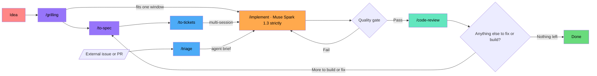

# AI Coding Workflow

Inspired by **Matt Pocock's** skills -- AI Engineering/ Coding??? lol. Runs on **OpenCode Go** with [`mattpocock/skills`](https://github.com/mattpocock/skills).

**Contents:** [Setup](#setup) · [Agents](#agents) · [The main pipeline](#the-main-pipeline) · [Alternate paths](#alternate-paths) · [skills.md](skills.md) · [models.md](models.md) · [LEARNING.md](LEARNING.md)

---

## Setup

Run `/setup-matt-pocock-skills` once per repo: pick a tracker (GitHub / GitLab / local `.scratch/`), triage labels, domain docs. It writes `docs/agents/*.md` plus an `## Agent skills` block in AGENTS.md / CLAUDE.md.
- Create the 7 triage labels once per tracker (`gh label create bug enhancement needs-triage needs-info ready-for-agent ready-for-human wontfix`) — setup writes the mapping, not the labels (#616)

## Agents

Every stage runs on the **build** agent. Mid-stage: flip to `plan` to discuss what you want, back to `build` to execute.

---

## The main pipeline

```
idea → grilling → to-spec → to-tickets → implement → code-review
```



A fuzzy idea walks in, gets grilled into shape, then built and reviewed before it ships. How far down the chain it goes depends on size — see below. Work that arrives from outside — bug reports, feature requests, unannounced PRs — enters through the triage lane (see [skills.md](skills.md)): verified, briefed, then dropped into the same implement queue.

### Pick by build size

One question picks the depth: **can the build fit in one fresh context window?**

| Build | Flow | Example |
|---|---|---|
| tiny — could've just done it | grill → implement (same window) | add a flag, accept single-digit hours |
| small — decisions worth keeping | grill → to-spec → implement (fresh session, reads spec) | a name-matching rule worth recording |
| multi-session / parallel slices | full chain, `/implement` per ticket | fete POS: skeleton → cash sale → tenders → EOD |

- grill → to-spec → to-tickets stay in one unbroken window; every `/implement` starts fresh
- too-low tell: implement keeps blowing its window · too-high tell: the spec has one obvious ticket

---

## Alternate paths

| Path | Flow | Est. cost |
|------|------|-----------|
| New project | full pipeline | ~$0.04–0.13 |
| Small feature | grill → spec → implement (build fits one window — [pick by build size](#pick-by-build-size)) | ~$0.02–0.05 |
| Feature add | pick depth by [build size](#pick-by-build-size); cross-cutting: implement at max effort | ~$0.03–0.08 |
| Bug fix | diagnosing-bugs → review → discuss → implement → loop | ~$0.05–0.18 |
| Arch redesign | scan → spec → tickets → implement → review | ~$0.08–0.25 |
| Prototype | prototype → iterate | ~$0.01 |

---

Every skill — stages, supporting skills, triage, wayfinder — lives in [skills.md](skills.md), with per-skill Default/Escalation routing lines. Model pricing, request limits, and budget tracking are in [models.md](models.md). Workflow decisions over time: [LEARNING.md](LEARNING.md).
